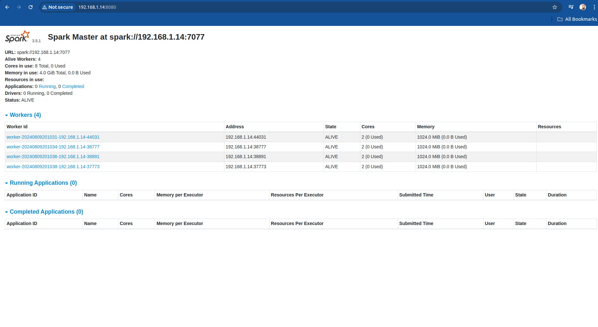

<h1> Setup Apache Spark </h1>
<h4>Deployment is motivated by the below blog but lot of customization were made on top. </h4>

https://www.howtoforge.com/how-to-install-apache-spark-on-ubuntu-22-04/

<h3>Install Java as Apache Spark is based on Java </h3>
<code>sudo apt-get install default-jdk curl -y</code><br>
<h3>Download latest stable Spark</h3>
<code>wget https://dlcdn.apache.org/spark/spark-3.5.1/spark-3.5.1-bin-hadoop3.tgz</code>
<h3>Extract the downloaded file</h3>
<code>tar xvf spark-3.5.1-bin-hadoop3.tgz</code>
<h3>Switch to root user</h3>
<code>sudo su</code>
<h3>Move the extracted file to /opt</h3>
<code>mv spark-3.5.1-bin-hadoop3/ /opt/spark</code>
<h3>Define spark path in .bashrc file</h3>
<h4>Open bash script</h4>
<code>nano ~/.bashrc</code>
<h4>Add following lines to the bashrc file</h4>
<code>export SPARK_HOME=/opt/spark <br>
export PATH=$PATH:$SPARK_HOME/bin:$SPARK_HOME/sbin
</code>
<h3>Activate the Spark environment variable using the following command</h3>
<code>source ~/.bashrc</code>
<h3>Create a dedicated user to run Apache Spark</h3>
<code>useradd spark</code>
<h3>Next, change the ownership of the /opt/spark to spark user and group</h3>
<code>chown -R spark:spark /opt/spark</code>
<h3>Create a Systemd Service File for Apache Spark</h3>
<h4>First, create a service file for Spark master using the following command:</h4>
<code>nano /etc/systemd/system/spark-master.service</code>
<h4>Add following lines to the file</h4>
```
[Unit]
Description=Apache Spark Master
After=network.target

[Service]
Type=forking
User=spark
Group=spark
ExecStart=/opt/spark/sbin/start-master.sh
ExecStop=/opt/spark/sbin/stop-master.sh

[Install]
WantedBy=multi-user.target
```
<h4>Create a service file for Spark slave/ worker:</h4>
<code>nano /etc/systemd/system/spark-slave.service</code>
<h4>Add following lines to the file</h4>
```
[Unit]
Description=Apache Spark Worker
After=network.target

[Service]
Type=forking
User=spark
Group=spark
ExecStart=/opt/spark/sbin/start-worker.sh spark://192.168.1.14:7077
ExecStop=/opt/spark/sbin/stop-worker.sh

[Install]
WantedBy=multi-user.target
```
<h5>Ensure to add the IP and port of master for proper mapping of worker to master.</h5>

<h3>Make following changes in spark-env file</h3>
<h4>First copy template file to shell script</h4>
<code>cp /opt/spark/conf/spark-env.sh.template /opt/spark/conf/spark-env.sh</code>
<h4>Add following line to the shell script</h4>
```
export SPARK_MASTER_HOST=192.168.1.14
export SPARK_WORKER_MEMORY=1g
export SPARK_WORKER_CORES=2
export SPARK_MASTER_URL=spark://192.168.1.14:7077
export SPARK_WORKER_INSTANCES=4
export SPARK_EXECUTOR_CORES=2
```
<h5>Configuration for 4 worker nodes is done here in the conf file</h5>
<h3>Reload the systemd daemon to apply the changes</h3>
<code>systemctl daemon-reload</code>

<h2>Setup Spark Cluster</h2>
<h3>Enable spark master node</h3>
```
systemctl start spark-master
systemctl enable spark-master
# Check status
systemctl status spark-master
```
<h4>Spark master can be seen on UI on this IP https://192.168.1.14:8080</h4>

<h3>Launch worker nodes</h3>
```
sudo -u spark /opt/spark/sbin/start-worker.sh spark://192.168.1.14:7077 --webui-port 8081
sudo -u spark /opt/spark/sbin/start-worker.sh spark://192.168.1.14:7077 --webui-port 8082
sudo -u spark /opt/spark/sbin/start-worker.sh spark://192.168.1.14:7077 --webui-port 8083
sudo -u spark /opt/spark/sbin/start-worker.sh spark://192.168.1.14:7077 --webui-port 8084
```
<h4>The above will deploy worker node on the ports 8081,8082,8083 and 8084 each with 2 cores and 1 GB memory as specified in spark_conf.sh file above.</h4>

<h2>Spark UI after successful deployment</h2>


<h2>Testing the cluster</h2>
```
spark-submit --master spark://192.168.1.14:7077 --executor-memory 1G --executor-cores 2 --total-executor-cores 4 test_app.py
```
<h4>The above test_case.py file is included in the repo and was used to test the spark job. Testing was succesful with the script running in desired # worker nodes</h4>
<h4> 
--executor-cores is number of cores each worker will use<br>
--total-executor-cores is total core<br>

So the above job is submitted on 2 nodes only as we have each node with 2 cores and total ask is for 4 cores
</h4>